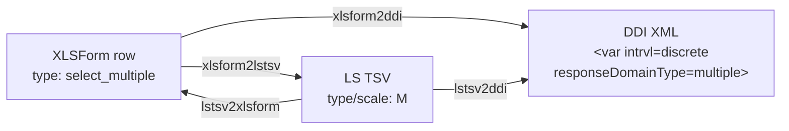

<!-- GENERATED by codegen — DO NOT EDIT BY HAND.
     Edit `registry/entities/select_multiple/definition.jsonld` and re-run `uv run codegen`. -->

# Select Multiple (`select_multiple`)

## Use when

When options are not mutually exclusive and respondents may select any number of applicable answers (e.g. languages spoken, devices owned).

## Cross-format mapping

| Format | Value |
|--------|-------|
| XLSForm typeString | `select_multiple` |
| LimeSurvey type code | `M` |
| DDI `intrvl` | `discrete` |
| DDI `responseDomainType` | `multiple` |
| DDI `varFormat/@type` | `numeric` |

## Lifecycle across the ecosystem

DDI is the terminus: it describes the dataset, not the instrument, so there is no
path back out of it (see `src/pipelines/README.md`).

## Variants

| ID | Label | Notes | Use when |
|----|-------|-------|----------|
| [`select_multiple_other`](../select_multiple_other/) | Select Multiple with Other | `or_other` | When a multi-select question has an open-ended 'other' response option for unlisted selections. |
| [`select_multiple_long_list`](../select_multiple_long_list/) | Select Multiple (Long List) | external file, appearance=minimal | When selecting multiple answers from a long non-exclusive list maintained as a controlled vocabulary, presented via a compact interface. |

## Constraints

- Variable name ≤ 20 chars, pattern `^[a-zA-Z0-9]+$`
- Choice code ≤ 5 chars, pattern `^[a-zA-Z0-9]+$` (truncated in LimeSurvey, prefix collisions warned)
- ⚠️ Choice codes > 5 chars will be truncated in LimeSurvey
- ⚠️ Avoid choice codes with identical 5-char prefixes

## Tests

- `src/test/registryConformance.test.ts` (XLSForm → LS TSV contract + tsv.tsv snapshots, vitest)
- `src/test/ddi/` (XLSForm → DDI emitter unit tests + ddi.xml snapshots, vitest)
- `tests/validation/test_ddi_schema.py` (XSD + schematron over blessed snapshots)

## Source

- [`definition.jsonld`](definition.jsonld) — the QuestionType entry (single source for codegen)
- `xlsform.json` + derived `ddi.xml` / `tsv.tsv` / `xlsform.xlsx` / `meta.json` — this type's own worked example, alongside in this folder
- `../<variant>/` — sibling folders for each real variant (e.g. `_other`, `_long_list`)
