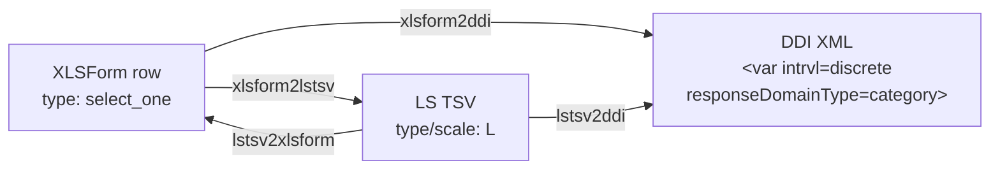

<!-- GENERATED by codegen — DO NOT EDIT BY HAND.
     Edit `registry/entities/select_one/definition.jsonld` and re-run `uv run codegen`. -->

# Select One (`select_one`)

## Use when

When answer categories are exhaustive and mutually exclusive, and exactly one option should be selected (e.g. education level, employment status).

## Cross-format mapping

| Format | Value |
|--------|-------|
| XLSForm typeString | `select_one` |
| LimeSurvey type code | `L` |
| DDI `intrvl` | `discrete` |
| DDI `responseDomainType` | `category` |
| DDI `varFormat/@type` | `numeric` |

## Lifecycle across the ecosystem

DDI is the terminus: it describes the dataset, not the instrument, so there is no
path back out of it (see `src/pipelines/README.md`).

## Variants

| ID | Label | Notes | Use when |
|----|-------|-------|----------|
| [`select_one_other`](../select_one_other/) | Select One with Other | `or_other` | When a single-select question has an open-ended 'other' response option for answers not covered by the predefined categories. |
| [`select_one_long_list`](../select_one_long_list/) | Select One (Long List) | external file, appearance=minimal | When selecting one answer from a long closed list (typically 15+ options) such as countries or occupations, where a dropdown or autocomplete interface is preferable to many radio buttons. |

## Constraints

- Variable name ≤ 20 chars, pattern `^[a-zA-Z0-9]+$`
- Choice code ≤ 5 chars, pattern `^[a-zA-Z0-9]+$` (truncated in LimeSurvey, prefix collisions warned)
- ⚠️ Choice codes > 5 chars will be truncated in LimeSurvey

## Tests

- `src/test/registryConformance.test.ts` (XLSForm → LS TSV contract + tsv.tsv snapshots, vitest)
- `src/test/ddi/` (XLSForm → DDI emitter unit tests + ddi.xml snapshots, vitest)
- `tests/validation/test_ddi_schema.py` (XSD + schematron over blessed snapshots)

## Source

- [`definition.jsonld`](definition.jsonld) — the QuestionType entry (single source for codegen)
- `xlsform.json` + derived `ddi.xml` / `tsv.tsv` / `xlsform.xlsx` / `meta.json` — this type's own worked example, alongside in this folder
- `../<variant>/` — sibling folders for each real variant (e.g. `_other`, `_long_list`)
