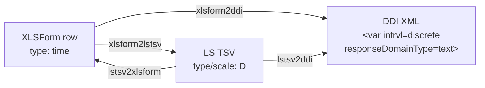

<!-- GENERATED by codegen — DO NOT EDIT BY HAND.
     Edit `registry/entities/time/definition.jsonld` and re-run `uv run codegen`. -->

# Time (`time`)

## Use when

When capturing a time of day without an associated date (e.g. preferred appointment time).

## Cross-format mapping

| Format | Value |
|--------|-------|
| XLSForm typeString | `time` |
| LimeSurvey type code | `D` |
| DDI `intrvl` | `discrete` |
| DDI `responseDomainType` | `text` |
| DDI `varFormat/@type` | `character` |

## Lifecycle across the ecosystem

DDI is the terminus: it describes the dataset, not the instrument, so there is no
path back out of it (see `src/pipelines/README.md`).

## Constraints

- Variable name ≤ 20 chars, pattern `^[a-zA-Z0-9]+$`

## Tests

- `src/test/registryConformance.test.ts` (XLSForm → LS TSV contract + tsv.tsv snapshots, vitest)
- `src/test/ddi/` (XLSForm → DDI emitter unit tests + ddi.xml snapshots, vitest)
- `tests/validation/test_ddi_schema.py` (XSD + schematron over blessed snapshots)

## Source

- [`definition.jsonld`](definition.jsonld) — the QuestionType entry (single source for codegen)
- `xlsform.json` + derived `ddi.xml` / `tsv.tsv` / `xlsform.xlsx` / `meta.json` — this type's own worked example, alongside in this folder
- `../<variant>/` — sibling folders for each real variant (e.g. `_other`, `_long_list`)
